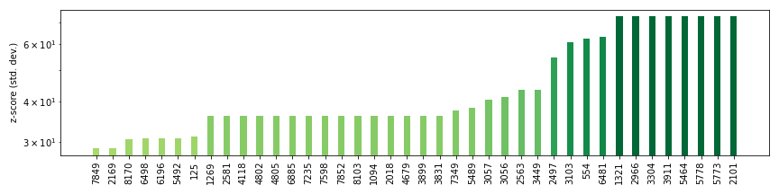
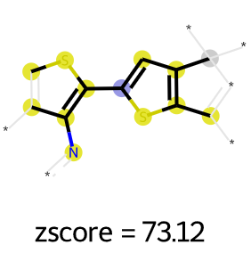

[](https://opensource.org/licenses/MIT)
[](https://circleci.com/gh/LiamWilbraham/molz)
[](https://www.code-inspector.com/project/16914/score/svg)
[](https://www.code-inspector.com/project/16914/status/svg)

# molZ

Statistical analysis tool to help identify molecular fragments that promote, or detract from,
target properties.

Sepecifically, this tool calculates the "z-scores" of molecular substructures in a given
sub-population of a database to identify fragments that are over- or under-represented in this
sub-population relative to a reference population. These substructures can either be specified
by the user, or automatically generated using Morgan fingerprints.

## How to install

molZ relies heavily on [RDKit](https://www.rdkit.org), which I recommend installing via conda
forge:

```
$ conda install -c conda-forge rdkit
```

After that, molZ can be installed with `pip`:

```
$ pip install molz
```

## How to use

Using auto-generated fragments:

```python
from molz import ZScorer

# instantiate scorer class, optionally set length and radius of morgan fingerprint.
# In this case, data.csv is a .CSV file of two columns: SMILES and computed LogP.
scorer = ZScorer('data.csv', fp_rad=3, fp_bits=4096)

# We are going to compute zscores of fragments present in high logp molecules.
scorer.score_fragments('penalised_logp', [12, 25])

# We can plot a bar graph of zscores for the 15 highest and lowest scoring fragments.
# Also, we can draw a given fragment by refering to its Morgan fingerprint bit index.
scorer.plot(k=15, save_to='zscores_auto.png')
scorer.draw_fragment(3595)

```

Using user-defined fragments:

```python
from molz import ZScorer

# instantiate scorer class. In this case, data.csv is a .CSV file of two columns:
# SMILES and computed LogP.
scorer = ZScorer('data.csv')

# We are going to compute zscores of fragments present in high logp molecules.
scorer.score_fragments(
    'penalised_logp', [12, 25], fragment_smiles=['CCCC', 'OC', 'N(C)(C)']
)

# We can plot a bar graph of zscores for the 15 highest and lowest scoring fragments.
# Also, we can draw a given fragment by refering to its SMILES.
scorer.plot(k=15, save_to='zscores_user.png')
scorer.draw_fragment('CCCC')
```

## Example of organic photovoltaics

We will use the data from ["Design Principles and Top Non-Fullerene Acceptor Candidates for
Organic Photovoltaics"](https://doi.org/10.1016/j.joule.2017.10.006) by Lopez et. al. as an
example.

First, we need the data, which comes from the article supplementary info:

```
$ curl https://ars.els-cdn.com/content/image/1-s2.0-S2542435117301307-mmc2.csv > lopez_data.csv
```

Now, we will use `molz` to detect over- and under-represented molecular fragments in molecues
with a predicted HOMO energy of greater than -5 eV.

We will use a relatively large number of fingerprint bits, to minimize
[bit collisions](http://rdkit.blogspot.com/2014/02/colliding-bits.html).

```python
from molz import ZScorer

# we will use the 'HOMO_calc' data column.
scorer = ZScorer('lopez-data.csv', fp_bits=8192, fp_rad=3)
scorer.score_fragments('HOMO_calc', [-5, 10])

scorer.plot(k=40, figsize=(12, 3), save_to='example_pce.png', top_only=True, log_y=True)
```

Which gives the following plot:



In this case the fragments (x axis) are expressed as bit vector positions. Drawing the top
fragments reveals a series of particularly electron-rich substructures, which is what we'd expect
for relatively high-energy HOMO orbitals. For instance:

```
scorer.draw_fragment(5773)
```


